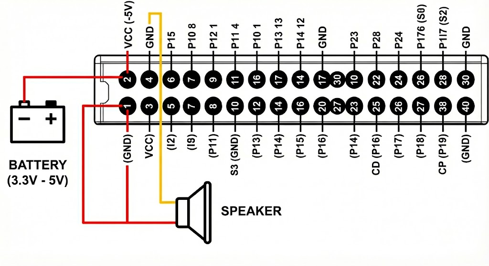
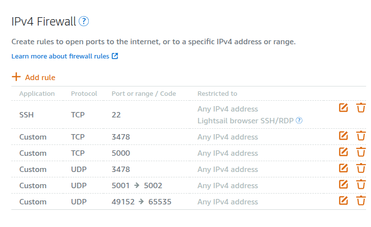

# T5AI DevKit Smart AI Doorbell

A fully customizable and repairable smart AI doorbell system. Unlike proprietary solutions like Ring or Nest, the T5AI DevKit provides the freedom to connect with any IP camera and any server, moving beyond the limitations of closed ecosystems.

## �️ Project Roadmap

- [x] Web Bluetooth (BLE) configuration interface to change WiFi and TCP server settings directly from the browser
- [x] Two-way audio communication: DevKit microphone streaming to web client via WebRTC/Opus, and voice recording from browser played on DevKit speaker via TCP
- [ ] Research BLE security - investigate whether unauthorized Bluetooth devices can connect and modify settings
- [ ] Battery integration - purchase battery and implement battery status monitoring via web client
- [ ] AI integration - add voice recognition, person detection, or other AI capabilities
- [ ] IP camera integration - connect external IP cameras for video streaming
- [ ] 3D printed enclosure - design and print a custom case for the smart doorbell

## �📁 Project Structure

```
├── 1-devkit/               # DevKit Firmware (build, flash, configure)
├── 2-webapp/               # Web Application (deploy to VPS)
├── 3-plan/                 # Planning Documents (development roadmap)
├── 4-ai-context/           # AI Conversation History (LLM chat logs)
├── docs/                   # Documentation assets (images, diagrams)
└── README.md               # This file
```

---

## 🔌 Hardware Wiring Diagram



### Connections
- **Battery (3.3V - 5V)**: Connect to VCC (+5V) and GND pins
- **Speaker**: Connect to S3 (GND) and speaker output pins

## 🎤 Audio Streaming Architecture


### How It Works

The system provides **two-way audio communication** between the web browser and T5AI DevKit:

#### 🎧 Live Microphone Stream (DevKit → Browser)
1. **DevKit captures audio** from its built-in microphone
2. **Opus encoding** compresses the audio in real-time
3. **WebRTC transport** streams audio to the VPS server
4. **VPS relays** the audio stream to connected web browsers
5. **Browser plays** the audio with live waveform visualization (green bars)

#### 🔊 Voice Message to DevKit (Browser → DevKit)
1. **Browser records** audio from your microphone
2. **Server converts** the audio to MP3 format (16kHz, mono)
3. **TCP transport** sends audio data to DevKit
4. **DevKit plays** the audio through its speaker

---

## Architecture

```
┌─────────────────────────────────────────────────────────────────────┐
│ VPS (with Cloudflare Tunnel)                                       │
│                                                                     │
│  ┌─────────────────────────────────────────────────────────────┐  │
│  │ tuya-webapp (podman container)                              │  │
│  │                                                              │  │
│  │  Port 3000: HTTP + WebSocket (via Cloudflare tunnel)        │  │
│  │  Port 5000: TCP Server (for DevKit connection)              │  │
│  │  Port 5001: UDP (for microphone audio)                      │  │
│  │  Port 5002: WebRTC (for browser audio playback)             │  │
│  └──────────────────────────────────────────────────────────────┘  │
│                                 │                                   │
│  ┌──────────────────────────────┴───────────────────────────────┐  │
│  │ cloudflared (Cloudflare Tunnel)                              │  │
│  │ Exposes port 3000 as https://your-domain.example.com        │  │
│  └──────────────────────────────────────────────────────────────┘  │
└─────────────────────────────────────────────────────────────────────┘
                                   │
                              Internet
                                   │
┌──────────────────────────────────┼──────────────────────────────────┐
│ T5AI DevKit                      │                                  │
│                                  ▼                                  │
│  - Connects to VPS:5000 via TCP                                    │
│  - Streams microphone audio via UDP:5001                           │
│  - Sends auth token for secure connection                          │
│  - Receives commands from web UI                                   │
│  - Responds with status, plays audio, etc.                         │
└─────────────────────────────────────────────────────────────────────┘
```

---

## 📱 Web Bluetooth (BLE) Configuration

Configure your DevKit locally via Bluetooth when the VPS is unreachable!

🔗 **Configuration Page**: `https://your-domain.com/ble` (same domain as your deployed webapp)

### Features
- **Set TCP Server**: Configure host, port, and auth token for VPS connection
- **Set WiFi Network**: Scan and connect to new WiFi networks  
- **View Status**: Check WiFi, TCP, and memory status
- **Connect/Disconnect TCP**: Manually control TCP connection
- **Reboot Device**: Remotely restart the DevKit

### How BLE Configuration Works

```
┌─────────────────────┐     Bluetooth LE      ┌─────────────────────┐
│   Mobile/Desktop    │◄────────────────────►│     T5AI DevKit     │
│     Web Browser     │    (encrypted Tuya    │                     │
│                     │     BLE protocol)     │                     │
└─────────────────────┘                       └─────────────────────┘
         │                                              │
         │  Configure:                                  │
         │  - WiFi SSID & Password                      │
         │  - TCP Server Host & Port                    │
         │  - Auth Token                                │
         │                                              │
         └──────────────────────────────────────────────┘
```

### Configuration Flow

1. **Power on DevKit** - BLE advertising starts (device name: "TYBLE" or "BLE")
2. **Open BLE config page** in Chrome/Edge (Android, Windows, macOS, Linux)
3. **Click "Connect to T5AI"** - Select your DevKit from Bluetooth picker
4. **Configure TCP Server Settings**:
   - **Host**: Your VPS public IP (e.g., `your-vps-ip`)
   - **Port**: `5000` (default TCP port)
   - **Token**: Your secret auth token (must match `AUTH_TOKEN` on server)
5. **Configure WiFi** (if needed):
   - Click "Disconnect WiFi" first
   - Click "Scan WiFi" to see available networks
   - Select network and enter password
   - Click "Connect to WiFi"
6. **Click "Reboot"** to apply all settings

> ⚠️ **Note**: Web Bluetooth is not supported on Safari (iPhone). Use Chrome on Android or desktop.

> 💡 **Tip**: BLE may be disabled when DevKit is already connected to WiFi/IoT cloud. Use "Scan All Devices" or factory reset if device doesn't appear.

---

## 🔌 Public API

The webapp exposes a public API endpoint for external integrations.

### Voice Message API

Send a voice message to the DevKit speaker from any application:

```bash
# Send audio file to DevKit (requires auth token)
curl -X POST https://your-domain.com/api/voice-message \
  -H "Authorization: Bearer YOUR_AUTH_TOKEN" \
  -H "Content-Type: audio/webm" \
  --data-binary @recording.webm
```

**Endpoint:** `POST /api/voice-message`

**Authentication:** Bearer token (same as `AUTH_TOKEN` environment variable)

**Content-Type:** `audio/webm`, `audio/mp3`, `audio/wav`, or `audio/ogg`

**Response:**
```json
{
  "success": true,
  "mp3Bytes": 12345
}
```

**How it works:**
1. Server receives audio in any format
2. FFmpeg converts to MP3 (16kHz, mono, 64kbps, 3x volume boost)
3. MP3 is chunked and sent to DevKit via TCP
4. DevKit's audio player decodes and plays through speaker

---

## 🔥 VPS Firewall Configuration

Open the following ports on your VPS to allow DevKit and browser connections.

### Required Ports

| Port | Protocol | Purpose |
|------|----------|----------|
| 22 | TCP | SSH access |
| 3000 | TCP | HTTP + WebSocket (for Cloudflare Tunnel) |
| 3478 | TCP + UDP | TURN server (WebRTC relay) |
| 5000 | TCP | DevKit command connection |
| 5001-5002 | UDP | Microphone audio streaming |
| 49152-65535 | UDP | WebRTC dynamic ports |

### AWS Lightsail Example



In AWS Lightsail:
1. Go to your instance → **Networking** tab
2. Under **IPv4 Firewall**, click **+ Add rule**
3. Add the following rules:

| Application | Protocol | Port or range |
|-------------|----------|---------------|
| SSH | TCP | 22 |
| Custom | TCP | 3478 |
| Custom | TCP | 5000 |
| Custom | UDP | 3478 |
| Custom | UDP | 5001 → 5002 |
| Custom | UDP | 49152 → 65535 |

> ⚠️ Port 3000 is **NOT exposed directly** - it's accessed via Cloudflare Tunnel for HTTPS.

---

## ☁️ Cloudflare Tunnel Configuration

Cloudflare Tunnel provides secure HTTPS access to your web UI without exposing port 3000 directly.

### Finding Your Local IP Address

You need to know the IP address to configure in Cloudflare Tunnel:

#### If using Podman with `--network host`:
```bash
# The server binds to 0.0.0.0, so use localhost or any interface IP
# In Cloudflare Tunnel, use:
localhost:3000

# Or get your VPS internal IP:
hostname -I | awk '{print $1}'
# Example output: 172.26.10.123
```

#### If running Go server directly (without container):
```bash
# Check what IP the server shows at startup:
go run main.go
# Output will show:
# Web UI + WS: http://172.26.10.123:3000

# Or use ifconfig:
ifconfig | grep -A1 eth0 | grep inet
# Example: inet 172.26.10.123 netmask 255.255.240.0
```

#### If using Podman bridge network:
```bash
# Get container IP:
podman inspect tuya-webapp-go | grep IPAddress
# Example: "IPAddress": "10.88.0.5"

# Use this IP in Cloudflare Tunnel:
10.88.0.5:3000
```

### Cloudflare Tunnel Setup

1. **Go to Cloudflare Zero Trust Dashboard**
2. Navigate to **Networks** → **Tunnels**
3. Create or select your tunnel
4. Click **Configure** → **Public Hostname**
5. Add a new public hostname:
   - **Subdomain**: `devkit` (or your choice)
   - **Domain**: Select your domain
   - **Type**: `HTTP`
   - **URL**: `localhost:3000` (for `--network host`) or `<container-ip>:3000`

### Tunnel Configuration Summary

| Deployment Method | Tunnel URL Setting |
|-------------------|-------------------|
| Podman `--network host` | `localhost:3000` |
| Podman bridge network | `<container-ip>:3000` (get via `podman inspect`) |
| Direct Go binary | `localhost:3000` or `<eth0-ip>:3000` |
| Docker Compose on tunnel-net | `tuya-webapp-go:3000` (container name) |

### Verify Tunnel is Working

```bash
# Check tunnel status
cloudflared tunnel info your-tunnel-name

# Test the public URL
curl -I https://devkit.your-domain.com/health
# Should return: HTTP/2 200
```

---

## 📂 Folder Details

### 1. `1-devkit/` — DevKit Firmware

Tuya-based firmware for T5AI DevKit that:
- Connects to VPS via TCP with token authentication
- Streams microphone audio via UDP (raw PCM)
- Receives and plays MP3 audio through speaker
- Handles commands (ping, status, audio play, switch, etc.)
- Advertises via BLE for local configuration
- Reports back to web UI

```
1-devkit/
├── src/
│   ├── tuya_main.c        # Main application
│   ├── tcp_client.c       # TCP client for VPS connection
│   ├── mic_streaming.c    # Microphone UDP streaming
│   ├── speaker_streaming.c # Speaker audio playback
│   ├── ai_audio_player.c  # Audio playback (MP3/PCM)
│   ├── ble_config.c       # BLE command handler
│   └── ...                # Other source files
├── .env.example           # Example environment variables
├── .env                   # Your configuration (gitignored)
├── build_with_env.fish    # Build script with environment
└── CMakeLists.txt         # Build configuration
```

### 2. `2-webapp/` — Web Application

Go-based server that provides:
- **Web UI**: Beautiful dashboard to control the DevKit
- **WebSocket**: Real-time communication with the web browser
- **TCP Server**: Receives connections from the DevKit
- **UDP Server**: Receives microphone audio stream
- **WebRTC**: Streams live microphone audio to browsers with Opus encoding
- **REST API**: Public endpoints for external integrations
- **BLE Config Page**: `/ble` endpoint for Bluetooth configuration

```
2-webapp/
├── main.go            # Go server (HTTP + WS + TCP + UDP + WebRTC)
├── go.mod             # Go dependencies
├── Dockerfile         # Container build
├── docker-compose.yml # Optional compose file
├── .env.example       # Example environment variables
└── public/
    ├── index.html     # Main Web UI (dashboard)
    ├── login.html     # Session login page
    └── ble/           # BLE Configuration
        ├── index.html         # BLE config page
        └── tuya-ble-crypto.js # Tuya BLE encryption library
```

### 3. `3-plan/` — Planning Documents

Development roadmap and implementation plans:
- Feature specifications
- Architecture designs
- Implementation guides
- Technical notes

### 4. `4-ai-context/` — AI Conversation History

Chat logs with LLM-based AI assistants (Claude, GPT, etc.):
- Development discussions
- Problem-solving sessions
- Code review conversations
- Troubleshooting logs

> 💡 **Note**: Sensitive values (credentials, IPs, tokens) have been replaced with placeholders in these files.

---

## 🔧 DevKit Firmware: Build, Flash & Monitor

### Prerequisites

- T5AI DevKit with USB connection
- Python 3.x
- TuyaOpen SDK (this repository)

### List USB Devices

Check which USB serial port your DevKit is connected to:

```bash
ls -la /dev/ttyACM*
```

Typical output:
```
crw-rw---- 1 root dialout 166, 0 Dec 22 06:00 /dev/ttyACM0
crw-rw---- 1 root dialout 166, 2 Dec 22 06:00 /dev/ttyACM2
```

> Note: Usually `/dev/ttyACM0` is used for flashing.

### Configure Environment

```bash
cd 1-devkit

# Copy and edit the environment file
cp .env.example .env

# Edit .env with your values:
# - TUYA_PRODUCT_ID: Your Tuya product ID
# - TUYA_OPENSDK_UUID: Your license UUID
# - TUYA_OPENSDK_AUTHKEY: Your license auth key
# - TCP_SERVER_HOST: Your VPS public IP
# - TCP_SERVER_PORT: 5000
# - TCP_AUTH_TOKEN: A secret token (must match webapp)
```

### Build Firmware

```bash
cd 1-devkit

# Build the firmware
../tos.py build
```

### Flash Firmware

```bash
cd 1-devkit

# Flash to DevKit (replace /dev/ttyACM0 with your port)
../tos.py flash -p /dev/ttyACM0
```

### Monitor Serial Output

View real-time logs from the DevKit:

```bash
cd 1-devkit

# Monitor the output (replace /dev/ttyACM2 with your monitor port)
../tos.py monitor -p /dev/ttyACM2
```

> Tip: The monitor port is usually `/dev/ttyACM2` (different from flash port)

### Quick Reference Commands

```bash
# Check USB devices
ls -la /dev/ttyACM*

# Build
cd 1-devkit && ../tos.py build

# Flash
cd 1-devkit && ../tos.py flash -p /dev/ttyACM0

# Monitor
cd 1-devkit && ../tos.py monitor -p /dev/ttyACM2
```

---

## 🚀 Deploy Web Application to VPS

### Option 1: Deploy with Podman (Recommended)

#### Step 1: Sync Files to VPS

```bash
# From your local machine
cd 2-webapp
rsync -avz --exclude='.git' . user@your-vps-ip:~/tuya-webapp/
```

Or using SCP:

```bash
scp -r 2-webapp/* user@your-vps-ip:~/tuya-webapp/
```

#### Step 2: Build and Run with Podman

SSH into your VPS and run:

```bash
ssh user@your-vps-ip

# Stop and remove existing container (if any)
podman stop tuya-webapp-go 2>/dev/null
podman rm tuya-webapp-go 2>/dev/null

# Navigate to webapp directory
cd ~/tuya-webapp

# Build the Docker image
podman build -t tuya-webapp-go:latest .

# Run the container
podman run -d --name tuya-webapp-go --network host \
  -e AUTH_USERNAME=admin \
  -e AUTH_PASSWORD=your-secure-password \
  -e AUTH_TOKEN=your-secret-token \
  -e HTTP_PORT=3000 \
  -e TCP_PORT=5000 \
  -e UDP_PORT=5001 \
  tuya-webapp-go:latest
```

#### One-liner Deploy Script

Run this from your local machine to deploy everything in one command:

```bash
cd 2-webapp
rsync -avz --exclude='.git' . user@your-vps-ip:~/tuya-webapp/

ssh user@your-vps-ip "
  podman stop tuya-webapp-go 2>/dev/null
  podman rm tuya-webapp-go 2>/dev/null
  cd ~/tuya-webapp
  podman build -t tuya-webapp-go:latest .
  podman run -d --name tuya-webapp-go --network host \
    -e AUTH_USERNAME=admin \
    -e AUTH_PASSWORD=your-secure-password \
    -e AUTH_TOKEN=your-secret-token \
    -e HTTP_PORT=3000 \
    -e TCP_PORT=5000 \
    -e UDP_PORT=5001 \
    tuya-webapp-go:latest
"
```

#### Verify Deployment

```bash
# Check container is running
ssh user@your-vps-ip "podman ps --filter name=tuya-webapp-go"

# View logs
ssh user@your-vps-ip "podman logs tuya-webapp-go"
```

---

### Option 2: Run Without Podman (Direct Go)

If your VPS doesn't have Podman installed, you can run the Go server directly.

#### Install Dependencies on VPS

```bash
ssh user@your-vps-ip

# Install Go (if not already installed)
sudo apt update
sudo apt install -y golang-go

# Install FFmpeg (required for audio conversion)
sudo apt install -y ffmpeg

# Optional: Install Opus libraries for audio processing
sudo apt install -y libopus-dev libopusfile-dev
```

#### Copy and Run the Server

```bash
# From your local machine - sync files
rsync -avz --exclude='.git' 2-webapp/ user@your-vps-ip:~/tuya-webapp/

# SSH into VPS
ssh user@your-vps-ip
cd ~/tuya-webapp

# Download Go dependencies
go mod download

# Build the server
go build -o server main.go

# Run with environment variables
AUTH_USERNAME=admin \
AUTH_PASSWORD=your-secure-password \
AUTH_TOKEN=your-secret-token \
HTTP_PORT=3000 \
TCP_PORT=5000 \
UDP_PORT=5001 \
./server
```

#### Run as a Background Service (systemd)

Create a systemd service for automatic startup:

```bash
sudo tee /etc/systemd/system/tuya-webapp.service > /dev/null <<EOF
[Unit]
Description=Tuya WebApp Server
After=network.target

[Service]
Type=simple
User=ubuntu
WorkingDirectory=/home/ubuntu/tuya-webapp
Environment="AUTH_USERNAME=admin"
Environment="AUTH_PASSWORD=your-secure-password"
Environment="AUTH_TOKEN=your-secret-token"
Environment="HTTP_PORT=3000"
Environment="TCP_PORT=5000"
Environment="UDP_PORT=5001"
ExecStart=/home/ubuntu/tuya-webapp/server
Restart=always
RestartSec=5

[Install]
WantedBy=multi-user.target
EOF

# Enable and start the service
sudo systemctl daemon-reload
sudo systemctl enable tuya-webapp
sudo systemctl start tuya-webapp

# Check status
sudo systemctl status tuya-webapp
```

---

### Configure Cloudflare Tunnel

1. Go to **Cloudflare Zero Trust Dashboard**
2. Navigate to **Networks** → **Tunnels**
3. Select your tunnel
4. Add a **Public Hostname**:
   - **Subdomain**: `devkit` (or your choice)
   - **Domain**: Your domain (e.g., `example.com`)
   - **Type**: HTTP
   - **URL**: `localhost:3000` (or `tuya-webapp:3000` if using Docker network)

5. Access your web UI at `https://devkit.example.com`

---

## Security

### Authentication Layers

1. **HTTP Session Auth**: Protects the web UI
   - Username and password required to access the page
   - Session-based authentication with cookies

2. **WebSocket Token Auth**: Protects WebSocket commands
   - Token obtained after HTTP authentication
   - Required for all WebSocket messages

3. **TCP Token Auth**: Protects DevKit connection
   - DevKit sends `auth:<token>` on connect
   - Invalid tokens are rejected

### Important Security Notes

⚠️ **Never commit `.env` files with real credentials**

- Use strong, unique passwords
- Change default tokens before deployment
- Keep environment variables secure on your VPS
- The `.env.example` files contain only placeholders

---

## Available Commands

From the web UI, you can send these commands to the DevKit:

| Command | Description |
|---------|-------------|
| `ping` | DevKit responds with `pong` |
| `status` | Returns JSON with detection state, volume, heap size |
| `audio play` | Plays the alert audio on speaker |
| `audio stop` | Stops audio playback |
| `switch on` | Turns detection on (updates Tuya app) |
| `switch off` | Turns detection off |
| `mem` | Returns free heap memory |
| `mic on` | Starts microphone streaming |
| `mic off` | Stops microphone streaming |
| `vol:speaker:<0-100>` | Set speaker volume |
| `vol:mic:<0-100>` | Set microphone gain |
| `reset` | Factory resets the device |

---

## Troubleshooting

### DevKit can't connect to VPS

1. Check VPS firewall allows ports 5000 (TCP) and 5001 (UDP)
2. Verify `TCP_SERVER_HOST` in `1-devkit/.env` is correct
3. Ensure DevKit has WiFi connection
4. Check Tuya app pairing is complete

### WebSocket connection fails

1. Verify Cloudflare tunnel is running
2. Check the container is running: `podman ps`
3. Ensure login credentials are correct

### No audio from microphone stream

1. Click "Start" button in the Live Microphone Stream section
2. Check browser console for WebRTC errors
3. Verify DevKit is connected and microphone is working
4. Check UDP port 5001 is open on VPS

### Authentication fails

1. Verify `AUTH_TOKEN` matches in both:
   - `1-devkit/.env` (TCP_AUTH_TOKEN)
   - VPS environment variables (AUTH_TOKEN)

### View container logs

```bash
# If using Podman
podman logs tuya-webapp-go

# If using systemd
journalctl -u tuya-webapp -f
```

---

## Development

### Run webapp locally

```bash
cd 2-webapp
go mod download
AUTH_USERNAME=admin AUTH_PASSWORD=test AUTH_TOKEN=dev go run main.go
```

### Rebuild firmware after changes

```bash
cd 1-devkit
../tos.py build
../tos.py flash -p /dev/ttyACM0
```

---

## License

This project uses the TuyaOpen SDK. See the main repository for license details.
